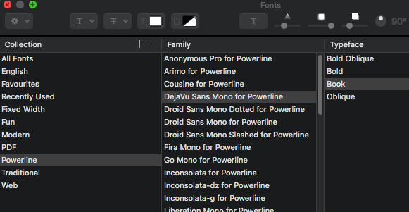

#fontwrangler - Command-line Font Category Creation in macOS

This is a quick console application in Swift that creates a new font category
and adds selected fonts. macOS doesn't seem to have a command-line utility that
does this simple task.

It was made to help automate the deployment of
[powerline-fonts](https://github.com/powerline/powerline-fonts) for usage with
tmux. It's probably just as useful for the vim 
[powerline](https://github.com/powerline/powerline) project.

After running the `./install.sh` script in powerline-fonts, you can run the
following command to create a new font category and place all powerline fonts
into it:

```fontwrangler Powerline powerline```

The results should look something like this in the UI:



I'm unfamiliar with Swift, so if there's any glaring errors or if the code looks
scary, you know why.
