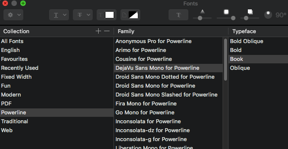

# fontwrangler - Command-line Font Category Creation in macOS

This is a quick console application in Swift that creates a new font category
and adds selected fonts. macOS doesn't seem to have a command-line utility that
does this simple task.

It was made to help automate the organization of
[powerline-fonts](https://github.com/powerline/powerline-fonts) into an orderly
font category.

I use it to categorize my fonts after installing powerline-fonts for use with
[iTerm2](https://iterm2.com) on macOS. It might also be useful for the vim 
[powerline](https://github.com/powerline/powerline) project.

## Basic Usage
```fontwrangler [category name] [search string]```

See below for a practical example.


# Using it to Install Powerline fonts
## The Hard Way

After running the `./install.sh` script from the powerline-fonts repo, you can run the
following command to create a new font category and place all powerline fonts
into it:

```fontwrangler Powerline powerline```

The results should look something like this in the UI:



## The Easy Way

Use the one-liner at my other project - [tidy-powerline-installer](https://github.com/mvknowles/tidy_powerline_installer)


# Disclaimers

I was unfamiliar with Swift when I wrote this, but it's not too horid (writing this 2 years later). Feel free to harrass me about anything that needs changing!

Not sure how I feel about it a few years later, but whatever. It's worked for years and has barely needed any modifications at all.
